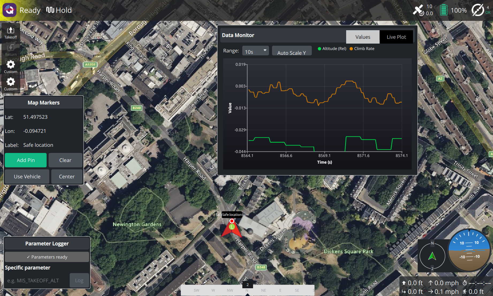

## Custom Build Example

To build this custom plugin:

- Add this repo. to the source tree of QgroundControl repository. 
- Clean you build directory of any previous build
- RMake sure that this repo is named as `custom`
- Build QGC

A short tutorial on setting up a custom widget [(https://rohith8272.github.io/posts/qgc-development-tutorial/)]

More details on what a custom build is and how to create your own can be found in the [QGC Dev Guide](https://dev.qgroundcontrol.com/en/custom_build/custom_build.html).

## Example widgets 

**CustomParameterWidget**
Access the vehicle specific parameters and log it to the console.

**MapMarkerWidget**
Widget for adding markers with text label on the map.

**SimpleVehicleDataWidget**
Access mavlink data from the vehicle and plot realtime data.
